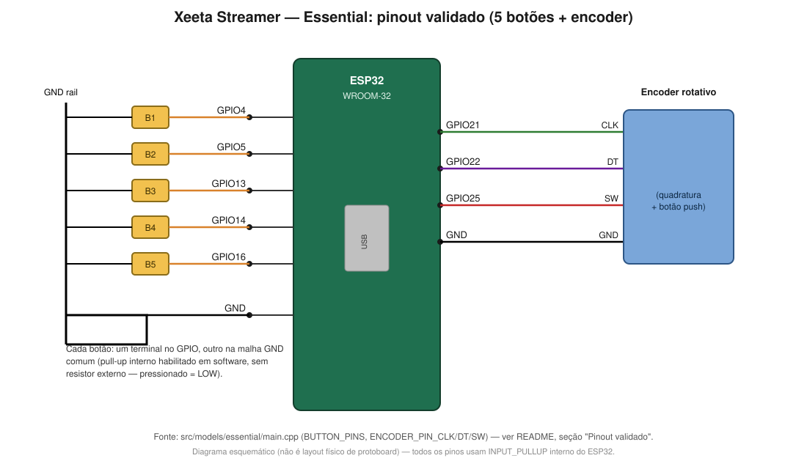

# Diagrama de ligação — protótipo Essential (5 botões + encoder)

Gerado a partir do pinout real usado no código (`src/models/essential/main.cpp`), sem nenhum resistor
externo — os pinos usam `INPUT_PULLUP` interno do ESP32 (`DirectGpioInput`/`EncoderInput`, ver
`src/hal/common/`).

## Tabela de pinos

| Componente        | Pino do componente | Pino do ESP32 | Outro terminal |
|--------------------|--------------------|-----------------|-------------------|
| Botão 1             | —                  | GPIO4            | GND (malha comum) |
| Botão 2             | —                  | GPIO5            | GND (malha comum) |
| Botão 3             | —                  | GPIO13           | GND (malha comum) |
| Botão 4             | —                  | GPIO14           | GND (malha comum) |
| Botão 5             | —                  | GPIO16           | GND (malha comum) |
| Encoder rotativo     | CLK                | GPIO21           | —                  |
| Encoder rotativo     | DT                 | GPIO22           | —                  |
| Encoder rotativo     | SW (clique)        | GPIO25           | —                  |
| Encoder rotativo     | GND                | —                | GND (malha comum) |

## Passo a passo na protoboard

1. Ligue um pino `GND` do ESP32 a uma trilha lateral da protoboard (a "malha GND comum").
2. Para cada botão: coloque-o sobre o canal central da protoboard, ligue um dos terminais à trilha GND
   comum e o outro terminal direto ao GPIO correspondente do ESP32 (ver tabela acima) — não precisa de
   resistor, o pull-up é habilitado em software.
3. Para o encoder (módulo tipo KY-040 ou equivalente): ligue `GND` do módulo à mesma trilha GND comum, e
   `CLK`/`DT`/`SW` cada um a um GPIO dedicado (GPIO21/22/25). Se o módulo tiver pino `+`/`VCC`, ele não é
   necessário para este circuito — os três sinais (`CLK`, `DT`, `SW`) já usam pull-up interno do ESP32,
   sem precisar de alimentação externa no módulo.
4. Confira que nenhum botão nem o encoder está compartilhando GPIO com outro componente — cada um tem
   seu pino dedicado (`DirectGpioInput`, sem matriz de varredura).
5. Para depurar fiação nova, ligue a flag `DEBUG_LOG_INPUT_EVENTS` em
   `src/models/essential/main.cpp` antes de compilar — ela ativa log de cada `InputEvent` e um dump
   periódico do estado cru de cada pino pelo monitor serial.

Esse pinout é específico do protótipo Essential com botões diretos (`DirectGpioInput`). O modelo
Streamer usa `ButtonMatrixInput` (matriz linha/coluna com diodos) em vez de um GPIO por botão — fiação
diferente, não coberta por este diagrama.
